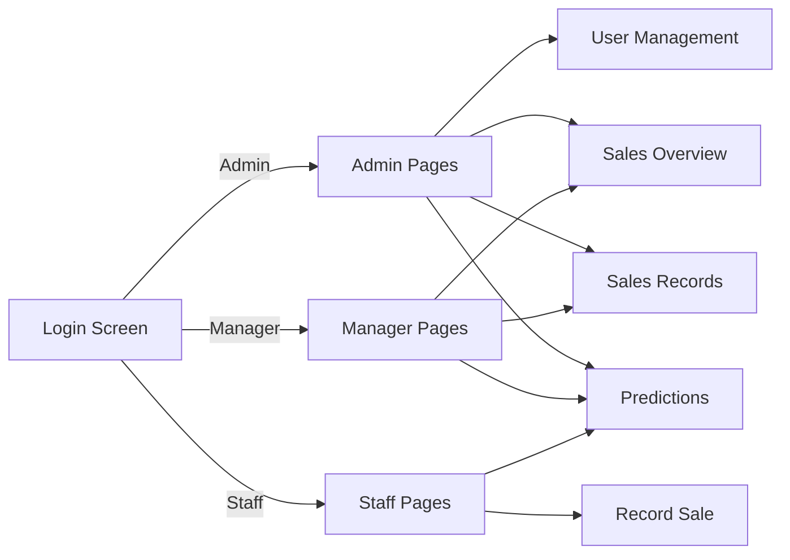

Below is a **copy-paste updated README.md** that:

* reflects your new **multi-file structure** (no longer “one big .py”)
* explains **how running it changes** (`python -m streamlit run app.py`)
* includes **two system diagrams** (Mermaid) you can paste directly into GitHub README
* adds clearer setup + troubleshooting for the modular version

---

## ✅ Updated `README.md` (with diagrams + multi-file run instructions)

````markdown
# Bristol Pink Café Dashboard

A Streamlit dashboard for the Bristol Pink Café case study:
- Upload café CSV sales files (coffee + croissant)
- View sales trends and best sellers
- Predict the next **4 weeks** (toggle to **8 weeks**) using:
  - AI (Heuristic)
  - ML (Linear Regression)
  - AI (Random Forest)
  - ML (Gradient Boosting)
- Role-based access:
  - **Admin**: create staff/manager accounts, reset passwords, change roles (and can do everything a Manager can)
  - **Manager**: view totals + charts, filter/export records, edit/delete sales entries, predictions
  - **Staff**: record sales entries, view/export their entries, predictions

---

## 1) Requirements
- Python **3.11+** (3.13 works too)
- Packages:
  - `streamlit`
  - `pandas`
  - `numpy`
  - `scikit-learn` (optional; required for ML modes)

---

## 2) Setup (Windows PowerShell)

### Create + activate a virtual environment
```powershell
python -m venv .venv
.\.venv\Scripts\Activate.ps1
````

### Install dependencies

```powershell
python -m pip install --upgrade pip
python -m pip install streamlit pandas numpy scikit-learn
```

(Optional) Save dependencies for teammates:

```powershell
python -m pip freeze > requirements.txt
```

---

## 3) Project structure (multi-file version)

This project is now split into multiple files to make it easier to navigate and maintain:

```
pinkcafe/
  app.py                 # Entry point (routes pages, applies theme, login gate)
  constants.py           # File paths + app constants
  theme.py               # BLACKPINK theme + theme switching + UI helpers
  auth.py                # Login + password hashing + user management helpers
  storage.py             # CSV load/save for users/prices/sales log
  forecasting.py         # CSV parsing + forecasting models + evaluation
  pages/
    __init__.py
    staff.py             # Staff pages (record sales)
    manager.py           # Manager pages (overview + records edit/delete)
    admin.py             # Admin pages (user management)
    predictions.py       # Predictions UI (upload, charts, forecasts)
  product_prices.csv
  users.csv              # created automatically if missing
  sales_entries.csv      # created automatically after first staff save
  requirements.txt       # optional
  README.md
  .venv/                 # local only, DO NOT commit
```

**Why this helps**

* You can edit the **predictions** without touching authentication.
* You can edit the **theme** without touching forecasting.
* Code becomes easier to test, update, and read.

---

## 4) Run the app (IMPORTANT CHANGE)

### Old (single-file) run

Previously you ran one large file like:

```powershell
python -m streamlit run dashboardfoodwastage.py
```

### New (multi-file) run

Now you run the **entry point**:

```powershell
python -m streamlit run app.py
```

If you are inside a parent folder, run:

```powershell
python -m streamlit run pinkcafe/app.py
```

---

## 5) Login (Demo Accounts)

This project uses simple demo accounts (change later if needed):

**Admin**

* Username: `admin`
* Password: `admin123`

**Manager**

* Username: `manager`
* Password: `manager123`

**Staff**

* Username: `staff`
* Password: `staff123`

> These are demo credentials. Change them for real use.

---

## 6) System diagram (high level)

```mermaid
flowchart TD
  U[User] -->|Browser| ST[Streamlit App (app.py)]
  ST --> AUTH[auth.py<br/>Login + Roles]
  ST --> THEME[theme.py<br/>Theme + UI helpers]
  ST --> PAGES[pages/*<br/>Role pages]
  PAGES --> STORAGE[storage.py<br/>CSV read/write]
  PAGES --> FORE[forecasting.py<br/>Parsing + Forecast models]
  STORAGE --> CSV1[users.csv]
  STORAGE --> CSV2[product_prices.csv]
  STORAGE --> CSV3[sales_entries.csv]
  FORE --> UPLOADS[Uploaded Coffee/Croissant CSVs]
```

---

## 7) Page routing diagram (role-based access)



---

## 8) Price list (teacher-provided)

The Staff sales entry page uses fixed unit prices from:

`product_prices.csv`

Example format:

```csv
product,unit_price
Cappuccino,3.50
Americano,3.00
Croissant,2.20
```

✅ Unit price is displayed as **£x.xx** and staff cannot edit it in the form.

If `product_prices.csv` is missing, the app creates a template—edit it with the correct teacher prices.

---

## 9) Staff sales logging

Staff entries are saved to:

`sales_entries.csv`

Columns:

* `date`
* `product`
* `qty`
* `unit_price`
* `staff_user`
* `created_at`

Manager pages read this file to show totals, charts, filters, exports, and edit/delete actions.

---

## 10) Prediction dashboard CSV inputs

Prediction page expects two CSV files:

### Coffee CSV (weird layout)

* Has a `Date` column
* First row contains product names in the other columns (e.g., Cappuccino, Americano)
* Following rows contain daily sales counts

### Croissant CSV (normal layout)

Columns like:

* `Date`
* `Number Sold` (or similar)

---

## 11) Troubleshooting

### “No module named streamlit”

You installed packages outside the venv. Activate the venv and reinstall:

```powershell
.\.venv\Scripts\Activate.ps1
python -m pip install streamlit pandas numpy scikit-learn
```

### “streamlit is not recognized…”

Use:

```powershell
python -m streamlit run app.py
```

### “ImportError / cannot import pages.*”

Make sure:

* you are running from the correct folder
* `pages/__init__.py` exists
* your structure matches the tree above

### I see Streamlit’s page dropdown in the sidebar

This is Streamlit’s native multipage UI. We hide it using CSS in `theme.py`.
If it appears, confirm your app calls:

* `hide_native_multipage_nav()` early in `app.py`

---

## 12) Notes (for submission)

* Passwords are stored as **hashed** (PBKDF2-HMAC-SHA256).
* This is still a coursework/demo app (not production security).
* Forecast accuracy is compared using a **time-based holdout** with MAE/RMSE/MAPE.

```

---

If you want, I can also:
- generate a **third Mermaid diagram** that shows the **data flow for forecasting** (Upload → Clean → Daily totals → Holdout eval → Forecast output)
- or produce a **proper “Architecture” section** for your report (aims, design choices, justification).
```
